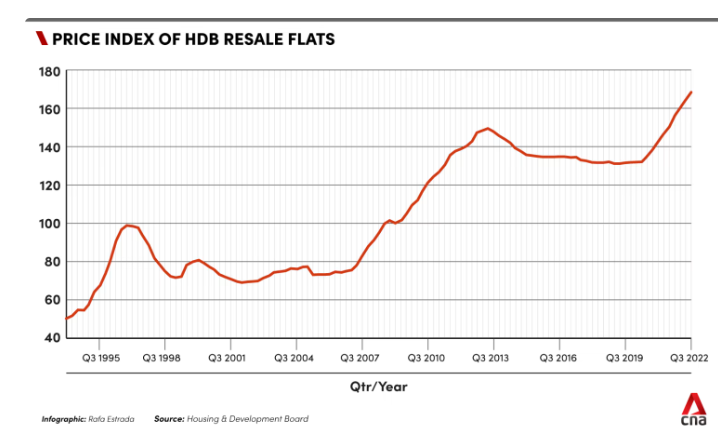
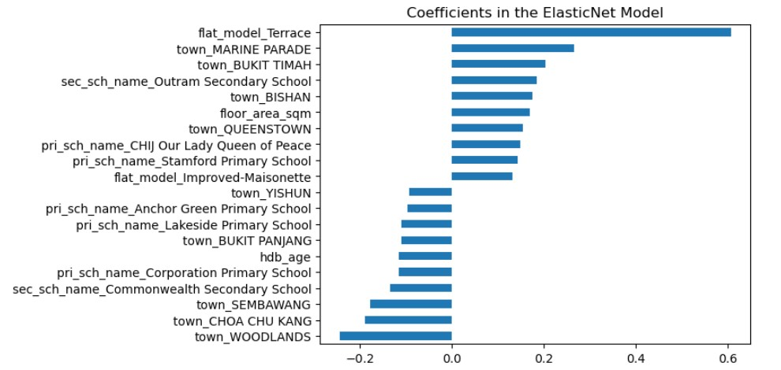

# Project 2:Singapore Housing Data and Kaggle Challenge

### Executive Summary
Singapore's housing market is dominated by the Housing and Development Board (HDB) flats, which serve as the primary dwelling for a significant portion of the population. In fact, HDB flats are home to around 78.7% of Singapore's residents, making them a crucial component of the country's housing landscape. As the supply of HDB flats for the resale market is set to decline sharply in the coming years, industry experts predict that this will lead to an increase in demand and, subsequently, prices. This trend is expected to continue as the difficulty in obtaining a new Build-to-Order (BTO) HDB flat through balloting further intensifies. As such, it is imperative for buyers, sellers, and agents alike to carefully consider the impact of these market dynamics on their decision-making processes.

### Problem statement
The resale market for HDB flats in Singapore is a critical component of the country's housing landscape, as it serves as a primary avenue for buyers and sellers to transact. However, determining the fair market value of an HDB flat can be a challenging task, as several factors may influence its resale price. To facilitate better decision-making processes for buyers and sellers, it is essential to identify which features have a significant impact on the resale value of HDB flats. By analyzing these features, we can aim to develop a predictive model that accurately estimates the fair market value of an HDB flat, thereby enabling buyers and sellers to make informed decisions about the transaction.

### Methodology
The data is retireved from https://www.kaggle.com/competitions/dsi-sg-project-2-regression-challenge-hdb-price/data  
train.csv -- this data contains all of the training data   
test.csv -- this data contains the test data thedel. We will feed this data into our regression model to make predictions.

### Brief summary of your analysis
The resale price data is skewed to the right. To prepare it for a linear regression model, we need to transform it using a logarithmic function. There are many features included in the dataset, so we used a correlation heatmap to identify and remove identical features, such as floor area in square meters and square feet, and the four indicators for the floor level of the flat. We kept only one feature to describe the age of the HDB by choosing between HDB age, year completed, and lease commence date. We removed latitude, longitude, and other amenities as well. To impute missing data for hawker and mall distance, we added zeros, as they can be understood as null values.  
In the end, we kept the following features for the model: 'town', 'flat_type', 'floor_area_sqm', 'flat_model', 'Transacted_Year', 'Transacted_Month', 'mid', 'hdb_age', 'max_floor_lvl', 'commercial', 'total_dwelling_units', '1room_sold', '2room_sold', '3room_sold', '4room_sold', '5room_sold', 'exec_sold', 'multigen_sold', 'studio_apartment_sold', '1room_rental', '2room_rental', '3room_rental', 'other_room_rental', 'Mall_Within_500m', 'Mall_Within_1km', 'Mall_Within_2km', 'Hawker_Within_500m', 'Hawker_Within_1km', 'Hawker_Within_2km', 'hawker_food_stalls', 'hawker_market_stalls', 'mrt_nearest_distance', 'bus_interchange', 'mrt_interchange', 'bus_stop_nearest_distance', 'pri_sch_nearest_distance', 'pri_sch_name', 'vacancy', 'pri_sch_affiliation', 'sec_sch_nearest_dist', 'sec_sch_name', 'cutoff_point', and 'affiliation'. We identified and transformed numerical and categorical features to make them readable for the linear model."

### Modeling
Before building a model, it's important to establish a baseline for metrics such as mean absolute error (MAE), mean squared error (MSE), and coefficient of determination (R2). These baselines serve as a reference point for evaluating the performance of the models we build.

In this project, we explored four different linear regression models: Linear Regression without regularization, Linear Regression with Ridge regularization (L2 penalty), Linear Regression with Lasso regularization (L1 penalty), and Linear Regression with ElasticNet regularization (L1 and L2 penalty). After evaluating each model's performance, we ultimately chose ElasticNet regularization as it had the lowest root mean squared error (RMSE).The ElasticNet model achieved an RMSE of 0.0866 on the training set and 0.0861 on the test set.

The coefficients of the elastic net model support our domain knowledge that locations closer to the city are a significant factor in determining higher resale flat prices.

### Conclusions/recommendations
The final model's predictions were found to be off by only 0.0859 from the true values, indicating a high level of accuracy. Notably, the model identified several positive coefficients that significantly impact the resale price of HDB flats. These include flat models such as terrace and improved maisonette, which are considered larger HDB types, as well as towns closer to the city center like Marina Parade, Bukit Timah, Queenstown, and Bishan. Furthermore, schools located near the city center also have a positive correlation with higher resale prices. Lastly, the floor area of an HDB flat was also found to have a significant impact on the resale price. Buyers and sellers can use this information to make informed decisions when pricing their HDB flats.

### Citation

1) How many applicants were successful in their BTO flat application at their first attempt? (Retrieved from https://www.todayonline.com/singapore/20-24-first-time-bto-applicants-mature-estates-succeed-first-try-less-2-need-more-5-tries-desmond-lee-2060306, December 1, 2022)  
2) High resale price (Retrieved from https://www.hdb.gov.sg/residential/selling-a-flat/overview/resale-statistics)

