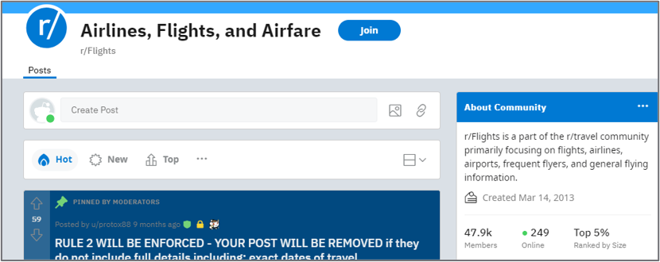
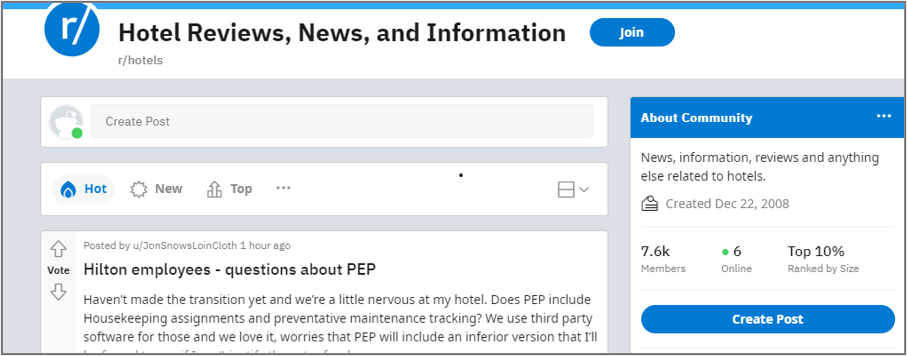
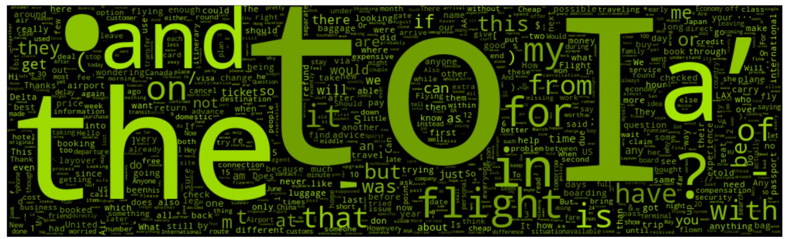
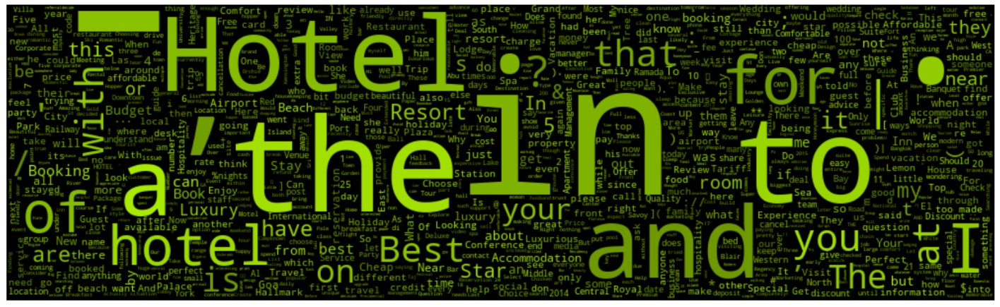
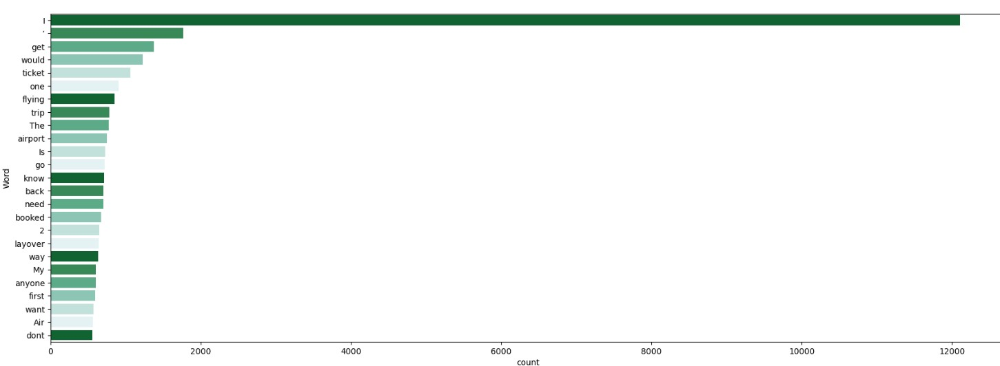
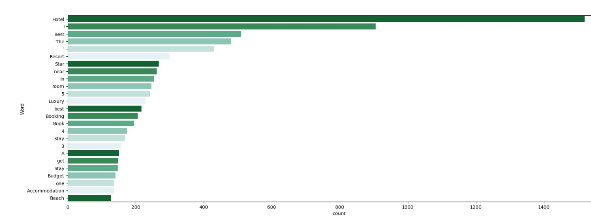
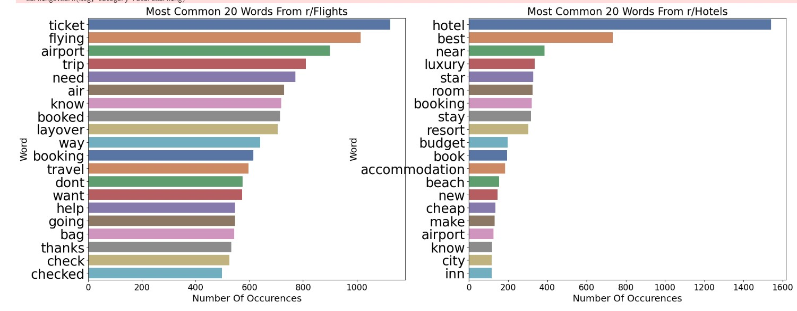

# Project 3: Web APIs & NLP

### Executive Summary
Trip.com Group Limited is a leading global one-stop travel platform, integrating a comprehensive suite of travel products and services and differentiated travel content.

The Company provides one-stop travel services through Ctrip and Qunar:

Our accommodation business provides over 1.2 million global accommodation offerings, covering hotels, motels, resorts, homes, apartments, bed and breakfasts, hostels, and other properties.
Our air ticketing business offers flights from over 480 airlines, covering over 2,600 airports in over 200 countries and regions.
We also offer over 310,000 in-destination activities around the world.
The Company provides travel services to non-Chinese customers mainly through Trip.com and Skyscanner.

The goal is to penetrate America especially North America and we plan to use be more visible on search engine thus marketing started keyword research. Keyword research is the process of finding and analyzing search terms that people enter into search engines with the goal of using that data for a specific purpose, often for search engine optimization (SEO) or general marketing. Keyword research can uncover queries to target, the popularity of these queries, their ranking difficulty, and more. In order to do so, we will need to identify keys words especially long-tail keywords that can get to the customers. 

Text classification gives you a richer SEO audit of the words that characterize your page content. Exploring word frequency against content in multiple pages will lead to more decisive SEO insights into inserting the words meant to be emphasized in a search query.

### Problem statement
Do a Keyword research to uncover queries to target and the popularity of these queries.

### Methodology
In this project, we will be using Reddit to pull from r/Flights and r/Hotels 5000 entrys each to build a text classification model to help the marketing team identify which word should be for flight domain and which word should be for hotel domain. The model will also help to identify the top few words with high coeficient to help the marketing team see if we can identify long-tail keywords.

### Brief summary of your analysis
We will do data cleaning to remove the duplciate and null and combine both textand title together. 

in the EDA and preprocessing, we remove non-english words and we use wordclouds to visualise the top 25 words before stopwords and visualise the top 25words without stopwords

For Flights 25 most frequent words withstopwords

For Hotels 25 most frequent words withstopwords

After removing stop words for Flights, 25 most frequent words

After removing stop words for Hotels, 25 most frequent words

After doing count vectorizer this are the new 20 words which we can use to queries to Flights or Hotels 

After which we Tokenize Lemmatize our data. Tokenization is the process of breaking a sequence of text into smaller units called tokens. In natural language processing, tokens are usually words or subwords that are used to represent the text data. Lemmatizing is the process of reducing a word to its base or root form, which is called the lemma. In linguistics, a lemma is the canonical form of a word, which represents its core meaning. For example, the lemma of the word "running" is "run", and the lemma of the word "better" is "good".

### Modeling
We train test fit with the below attributes
test_size = .3,  # 70% train 30% test
shuffle = True, # shuffles data prior to splitting
stratify = y, # distribution of classes across train and test
random_state = 3)# ensures same split each time to allow repeatability

We use the below  models to run and check on our test accuracy and below are the results.   
RandomForestClassifier,  
DecisionTreeClassifier,  
LogisticRegression,  
MultinomialN,  
KNeighborsClassifie

|model_name| accuracy_score| precision_score |recall_score| f1_score|
|---|---|---|---|---|
|LogisticRegression |      0.929048   |     0.928932 |    0.929191   |0.929016  |
|Multinomial Naive Bayes  |     0.917106   |     0.921325  |   0.915758   |0.916657 
| Random Forest   |    0.900948    |    0.900827  |   0.901068   |0.900903|
|  Decsision Tree  |      0.88725   |     0.887405  |   0.887688 |  0.887239 
| K Nearest Neighbor  |     0.544784   |     0.630084  |   0.555597   |0.475151

### Conclusions/recommendations

Through the model evalutation, we can see that Logistic Regression is the best score and it seems to be quite high in precision at around 92%. All other models are achieving around the same results indicting its not over train with the train data. Only K Nearest Neighbour perform poorly compared to the others. 

Generally the marketing team can use the 20 words shared to find on the words to use for the SEO strategy as it seems that the logistic regression model had performed well. 

